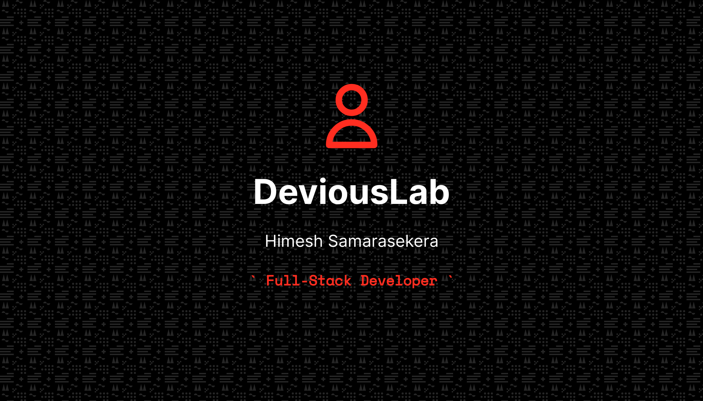

<h1 align="left">Hello! 👋</h1>
<h3 align="left">I'm a developer from Sri Lanka currently living in Dubai, UAE. I'm aiming to become proficient in the MERN stack and eventually become a full-stack developer. Attempting to gain knowledge in the cloud computing area with AWS and in DevOps.</h3>

- 🌱 I’m currently learning **HTML5, CSS3, JavaScript, React, Sass, Node.js, Python, GoLang, AWS, Git, Docker, Kubernetes**

- 👨‍💻 All of my projects are available at: [https://deviouslab.dev](https://deviouslab.dev)

- 📫 How to reach me: **deviouslab@gmail.com**

<h3 align="left">Connect with me:</h3>

  

